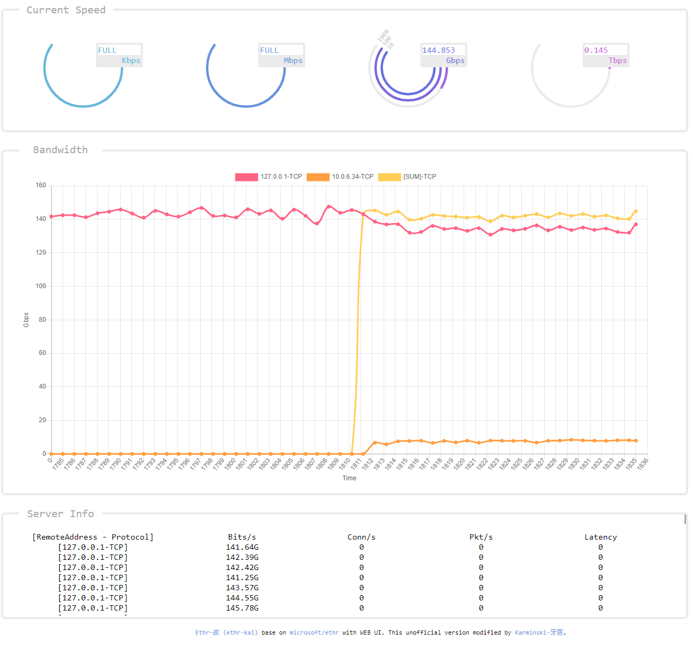

# Ethr-改　(ethr-kai) [](https://travis-ci.org/karminski/ethr)

[README(English)](./README.md)

该版本增加了一个带`websocket`的WEB界面(见下图), 方便普通用户使用.



(以下是机翻, 懒得手工翻译了, 凑合着看吧)

Ethr是一个用golang编写的跨平台网络性能测量工具。本项目的目标是提供一个本机工具，用于跨多个协议(如TCP、UDP、HTTP、HTTPS)和跨多个平台(如Windows、Linux和其他Unix系统)全面测量网络性能，包括带宽、连接/s、包/s、延迟、损耗和抖动。

Ethr从现有的开源网络性能工具中获得灵感，并以这些想法为基础。对于带宽测量，它类似于iPerf3，用于TCP和UDP流量。iPerf3有更多的选项，如节流测试、更丰富的特性集，而Ethr支持多线程，允许扩展到1024或更高数量的连接、多个客户端到单个服务器的通信等等。对于延迟测量，它类似于Windows上的latte或Linux上的sockperf。

与其他工具相比，Ethr提供了更多的测试度量，例如，它提供了对带宽、连接/s、包/s、延迟和TCP连接设置延迟的度量，所有这些都在一个工具中。在未来，还计划增加更多的特性(希望其他人也能有所贡献)以及更多的协议支持，使其成为全面的网络性能测量工具。

由于golang的存在，与通过cygwin这样的抽象层进行编译相比，Ethr本质上是跨平台的，而后者可能会限制功能。它希望通过结合iPerf3、ntttcp、psping、sockperf和latte等工具的功能来统一性能度量，并提供跨多个平台和多个协议的单一工具。


# 下载

https://github.com/karminski/ethr-kai/releases/latest


# 如何测试你的网络带宽

本测试需要两台机器 A, B.

使用上面的链接, 按照你的操作系统下载已经构建好的版本.

机器A:

```
ethr-kai -s -web
```
然后在你的浏览器里面打开 http://{机器A的IP地址}:8080/ 就可以看到web界面了.

机器B:

```
ethr-kai -c {机器A的IP} -d {测试时间} -n {线程数量}
```

- 机器A的IP, 即机器A的IP地址.
- 测试时间, 后面需要加时间单位, 例如 60s.
- 线程数量, 可以随意调节以达到最佳性能, 一般是CPU有多少核心就设置多少线程.

例如:

```
ethr-kai -c 192.168.1.2 -d 602 -n 4
```

这样测试开始, 就能在web界面看到图形化的测试数据了.

# 安装

如果想从头构建该项目, 需要 go 1.11 及以上版本.

# 从源代码构建

先获取依赖, 然后编译:

```
make fetch-dependency
make build-with-local-vendor
```

即可构建.

原始项目的构建方法为:

该项目使用 go-module 管理依赖. 详情见 [how to use go-modules!](https://github.com/golang/go/wiki/Modules#how-to-use-modules)

```
git clone https://github.com/karminski/ethr-kai.git
cd ethr-kai
go get ./...
go build
```

如果 clone 到了 `$GOPATH/src` 里面, 请确保执行`go`命令带 `GO111MODULE=on`选项.


# 使用方法

## 快速入门
显示帮助:
```
ethr-kai -h
```

启动服务器端:
```
ethr-kai -s
```

启动带命令行界面的服务器端:
```
ethr-kai -s -ui
```

启动带web界面的服务器端:

```
ethr-kai -s -web
```

启动客户端:
```
ethr-kai -c <server ip>
```

更多例子:
```
// 启动服务端
ethr-kai -s

// 本地测试localhost, 1线程
ethr-kai -c localhost

// 本地测试localhost, 8线程
ethr-kai -c localhost -n 8

// 本地测试localhost, 测试项目连接数, 8线程
ethr-kai -c localhost -t c -n 64
```

## 完整命令
```
Ethr - A comprehensive network performance measurement tool.
Version: [VERSION: UNKNOWN]
It supports 4 modes. Usage of each mode is described below:

Common Parameters
================================================================================
	-h 
		Help
	-no 
		Disable logging to file. Logging to file is enabled by default.
	-o <filename>
		Name of log file. By default, following file names are used:
		Server mode: 'ethrs.log'
		Client mode: 'ethrc.log'
		External server mode: 'ethrxs.log'
		External client mode: 'ethrxc.log'
	-debug 
		Enable debug information in logging output.
	-4 
		Use only IP v4 version
	-6 
		Use only IP v6 version

Mode: Server
================================================================================
	-s 
		Run in server mode.
	-ui 
		Show output in text UI.
	-web 
		Show output and charts on http port 8080.
	-ports <k=v,...>
		Use custom port numbers instead of default ones.
		A comma separated list of key=value pair is used.
		Key specifies the protocol, and value specifies base port.
		Ports used for various tests are calculated from base port.
		Example: For TCP, Bw: 9999, CPS: 9998, PPS: 9997, Latency: 9996
		Control is used for control channel communication for ethr.
		Note: Same configuration must be used on both client & server.
		Default: 'control=8888,tcp=9999,udp=9999,http=9899,https=9799'

Mode: Client
================================================================================
	-c <server>
		Run in client mode and connect to <server>.
		Server is specified using name, FQDN or IP address.
	-r 
		For Bandwidth tests, send data from server to client.
	-d <duration>
		Duration for the test (format: <num>[ms | s | m | h]
		0: Run forever
		Default: 10s
	-n <number>
		Number of Parallel Sessions (and Threads).
		0: Equal to number of CPUs
		Default: 1
	-ncs 
		No per Connection Stats would be printed if this flag is specified.
		This is useful to suppress verbose logging when large number of
		connections are used as specified by -n option for Bandwidth tests.
	-l <length>
		Length of buffer to use (format: <num>[KB | MB | GB])
		Only valid for Bandwidth tests. Max 1GB.
		Default: 16KB
	-p <protocol>
		Protocol ("tcp", "udp", "http", "https", or "icmp")
		Default: tcp
	-ic 
		Ignore Certificate is useful for HTTPS tests, for cases where a
		middle box like a proxy is not able to supply a valid Ethr cert.
	-ports <k=v,...>
		Use custom port numbers instead of default ones.
		A comma separated list of key=value pair is used.
		Key specifies the protocol, and value specifies base port.
		Ports used for various tests are calculated from base port.
		Example: For TCP, Bw: 9999, CPS: 9998, PPS: 9997, Latency: 9996
		Control is used for control channel communication for ethr.
		Note: Same configuration must be used on both client & server.
		Default: 'control=8888,tcp=9999,udp=9999,http=9899,https=9799'
	-t <test>
		Test to run ("b", "c", "p", or "l")
		b: Bandwidth
		c: Connections/s or Requests/s
		p: Packets/s
		l: Latency, Loss & Jitter
		Default: b - Bandwidth measurement.
	-i <iterations>
		Number of round trip iterations for each latency measurement.
		Default: 1000

Mode: External Server
================================================================================
	-m <mode>
		'-m x' MUST be specified for external mode.
	-s 
		Run in server mode.
	-ports <k=v,...>
		Use custom port numbers instead of default ones.
		A comma separated list of key=value pair is used.
		Key specifies the protocol, and value specifies the port.
		Default: 'tcp=9999,http=9899,https=9799'

Mode: External Client
================================================================================
	-m <mode>
		'-m x' MUST be specified for external mode.
	-c <destination>
		Run in external client mode and connect to <destination>.
		<destination> is specified using host:port format.
		Example: www.microsoft.com:443 or 10.1.0.4:22 etc.
	-d <duration>
		Duration for the test (format: <num>[ms | s | m | h]
		0: Run forever
		Default: 10s
	-n <number>
		Number of Parallel Sessions (and Threads).
		0: Equal to number of CPUs
		Default: 1
	-ncs 
		No per Connection Stats would be printed if this flag is specified.
		This is useful to suppress verbose logging when large number of
		connections are used as specified by -n option for Bandwidth tests.
	-l <length>
		Length of buffer to use (format: <num>[KB | MB | GB])
		Only valid for Bandwidth tests. Max 1GB.
		Default: 16KB
	-p <protocol>
		Protocol ("tcp", "http", "https", or "icmp")
		Default: tcp
	-t <test>
		Test to run ("b", "c", or "cl")
		b: Bandwidth
		c: Connections/s or Requests/s
		cl: TCP connection setup latency
		Default: cl - TCP connection setup latency.
	-g <gap>
		Time interval between successive measurements (format: <num>[ms | s | m | h]
		0: No gap
		Default: 1s

```

# 功能

Protocol  | Bandwidth | Connections/s | Packets/s | Latency
------------- | ------------- | ------------- | ------------- | -------------
TCP  | Yes | Yes | No | Yes
UDP  | Yes | NA | Yes | No
HTTP | Yes | No | No | Yes
HTTPS | Yes | No | No | No
ICMP | No | NA | No | No

# 支持平台

**Windows**

Tested: Windows 10, Windows 7 SP1

Untested: Other Windows versions

**Linux**

Tested: Ubuntu Linux 18.04.1 LTS, OpenSuse Leap 15

Untested: Other Linux versions

**OSX**

Tested: OSX is tested by contributors

**Other**

No other platforms are tested at this time

# Todo List

Todo list work items are shown below. Contributions are most welcome for these work items or any other features and bugfixes.

* Test Ethr on other Windows versions, other Linux versions, FreeBSD and other OS
* Support for UDP bandwidth & latency testing
* Support for HTTPS bandwidth, latency, requests/s
* Support for HTTP latency and requests/s
* Support for ICMP bandwidth, latency and packets/s

# 如何贡献

This project welcomes contributions and suggestions.  Most contributions require you to agree to a
Contributor License Agreement (CLA) declaring that you have the right to, and actually do, grant us
the rights to use your contribution. For details, visit https://cla.microsoft.com.

When you submit a pull request, a CLA-bot will automatically determine whether you need to provide
a CLA and decorate the PR appropriately (e.g., label, comment). Simply follow the instructions
provided by the bot. You will only need to do this once across all repos using our CLA.

This project has adopted the [Microsoft Open Source Code of Conduct](https://opensource.microsoft.com/codeofconduct/).
For more information see the [Code of Conduct FAQ](https://opensource.microsoft.com/codeofconduct/faq/) or
contact [opencode@microsoft.com](mailto:opencode@microsoft.com) with any additional questions or comments.

